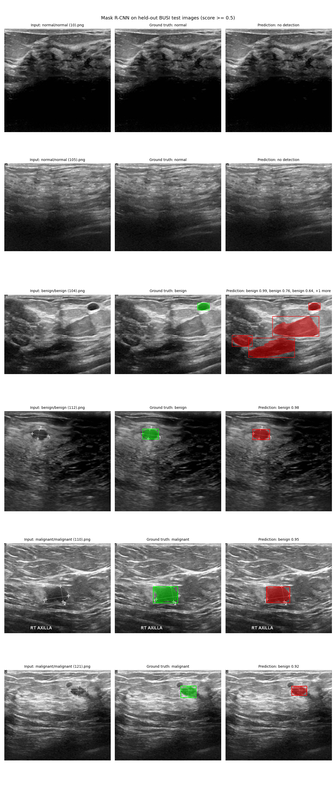

# Breast ultrasound lesion detection and segmentation with Mask R-CNN

Fine-tuning a COCO-pretrained Mask R-CNN to find, outline and label lesions
(benign or malignant) in breast ultrasound images from the public
[BUSI dataset](https://www.kaggle.com/datasets/aryashah2k/breast-ultrasound-images-dataset).

> **Scope.** Developed on a small public dataset. The models are not clinically
> validated and no diagnostic utility is claimed.

This was a three-person group project in which each member built a different
model. **I built the Mask R-CNN** (`mask_rcnn/`), and this README focuses on it.
The U-Net and ResNet-18 were built by my teammates and are described briefly
under [Group context](#group-context).

## Contents

- [Dataset](#dataset)
- [Method](#method)
- [Results (reproducible run, seed 42)](#results-reproducible-run-seed-42)
- [Reproducing the results](#reproducing-the-results)
- [Earlier results: coursework run (December 2024)](#earlier-results-coursework-run-december-2024)
- [Group context](#group-context)
- [Limitations](#limitations)
- [Repository layout](#repository-layout)
- [Team and contributions](#team-and-contributions)
- [License](#license)
- [References](#references)

## Dataset

Breast Ultrasound Images (BUSI), Al-Dhabyani et al. (2020):

- 780 ultrasound images from 600 female patients aged 25 to 75, about 500×500 px on average.
- Three classes: **133 normal, 437 benign, 210 malignant**. The classes are imbalanced: benign is 56% of images.
- Each image has one or more binary ground-truth masks (`<name>_mask.png`, `<name>_mask_1.png`, …), one per lesion. 17 images have more than one lesion (18 extra masks). Normal images have empty masks.
- The public release has **no patient identifiers**.

The data is not redistributed here. `python mask_rcnn/download_data.py`
fetches the pinned Kaggle release (`aryashah2k/breast-ultrasound-images-dataset`,
version 1) with `kagglehub` into `data/Dataset_BUSI_with_GT/`. It checks that
every file decodes and that the contents match a recorded SHA-256 fingerprint.
No Kaggle credentials are needed.

## Method

Mask R-CNN (He et al., 2017) is a two-stage detector. A region proposal
network suggests candidate regions, and for each region the network predicts a
class, a refined bounding box and a pixel mask. RoIAlign extracts region
features without the coordinate rounding of RoIPool, which matters for
pixel-accurate masks.

Implementation, following the
[torchvision fine-tuning tutorial](https://pytorch.org/tutorials/intermediate/torchvision_tutorial.html):

| | |
|---|---|
| Model | `torchvision` `maskrcnn_resnet50_fpn`: ResNet-50 backbone with a Feature Pyramid Network, pretrained on COCO |
| Heads | Box and mask predictors replaced for 3 classes (background, benign, malignant) |
| Input | Native image resolution (torchvision's internal resize). Random horizontal flip during training. |
| Optimiser | SGD, lr 0.005, momentum 0.9, weight decay 5e-4, step decay ×0.1 every 3 epochs, linear warm-up in epoch 1 |
| Training | 10 epochs, batch size 2 |
| Evaluation | COCO box and mask AP/AR via `pycocotools`. AP is class-aware: an outline with the wrong benign/malignant label counts as a miss. |

The training and evaluation loops (`engine.py` and helpers) are torchvision's
reference scripts. See [Third-party code](mask_rcnn/THIRD_PARTY.md).

## Results (reproducible run, seed 42)

From [`mask_rcnn/runs/seed42/`](mask_rcnn/runs/seed42/): trained at commit
`cb190d4` on an NVIDIA A10G (PyTorch 2.8.0, torchvision 0.24.0), on data whose
fingerprint matches the pinned Kaggle release. The test split is **118 images
(20 normal, 66 benign, 32 malignant; 98 lesions)**. It was evaluated once,
using the final-epoch model, with no checkpoint selection.

### Detection and segmentation (COCO, test split)

| COCO metric | Bounding box | Segmentation mask |
|---|---|---|
| AP @ IoU 0.50:0.95 | 0.477 | 0.475 |
| AP @ IoU 0.50 | 0.729 | 0.714 |
| AP @ IoU 0.75 | 0.598 | 0.508 |
| AR @ 100 detections | 0.672 | 0.672 |
| AP, medium lesions (32²–96² px) | 0.400 | 0.364 |
| AP, large lesions (> 96² px) | 0.462 | 0.474 |

The test split has no lesions in COCO's "small" range, so there is no
small-lesion AP. AP is class-aware: a correct outline with the wrong
benign/malignant label counts as a miss.

### Image-level classification (test split)

Each image is assigned the label of its highest-scoring detection at a score of
0.5 or above, or "normal" if there is none. The 0.5 threshold was carried over
from the original notebook and was not tuned.

| True \ predicted | normal | benign | malignant |
|---|---|---|---|
| **normal** (20) | 15 | 3 | 2 |
| **benign** (66) | 6 | 57 | 3 |
| **malignant** (32) | 1 | 8 | 23 |

| | Rate | Count |
|---|---|---|
| Lesion images with any detection (lesion sensitivity) | 0.93 | 91 / 98 |
| Normal images with no detection (specificity on normals) | 0.75 | 15 / 20 |
| Malignant images labelled malignant | 0.72 | 23 / 32 |
| 3-class accuracy | 0.81 | 95 / 118 |

For reference, labelling every test image "benign" would score 66 / 118 (0.56).

### How to read these

- **The most consequential error is malignant called benign: 8 of 32 malignant images**, plus 1 malignant image with no detection at all. Both malignant images in the figure below are this error, with scores of 0.95 and 0.92, so a high score did not mean a correct label.
- **5 of the 20 normal images received a false lesion detection.**
- **The numbers are imprecise.** With 20 normal and 32 malignant test images, one image changes a rate by 5 and 3 points respectively. No confidence intervals were computed.
- **Don't read the size breakdown as a size effect.** Of the 36 medium-sized test lesions only 4 are malignant, while 28 of the 32 malignant lesions are large. COCO averages AP over classes, so medium-lesion AP for the malignant class rests on 4 lesions. (Counts are from the committed split and the pinned dataset.)
- **Validation and test agree.** At the final epoch, validation scored box AP 0.470 and mask AP 0.475, against 0.477 and 0.475 on test. Validation AP plateaued from epoch 4, after the first learning-rate drop ([`val_history.json`](mask_rcnn/runs/seed42/val_history.json)).
- **This is one training run.** It ran on GPU without deterministic kernels, so the variation across seeds is unmeasured. The two coursework runs differed by up to 3.3 AP points.
- **Not directly comparable with the coursework run.** The test sets differ, and this run adds normal images and every lesion mask.

### Qualitative examples



The first two test images of each class in filename order, not picked for
quality. Ground truth is green, predictions are red. Both normal images
correctly get no detection. `benign (112)` is found and labelled correctly.
`benign (104)` has its small lesion found, plus three false detections in
surrounding tissue. Both malignant lesions are outlined in the right place but
labelled benign.

Several images carry sonographer calipers, measurement lines or text on or next
to the lesion (see [Limitations](#limitations)).

## Reproducing the results

`mask_rcnn/download_data.py`, `train.py`, `evaluate.py` and `figures.py`
rewrite the coursework notebook as a reproducible pipeline. The model and
hyperparameters are unchanged. What changed:

| | Coursework notebook | Reproducible scripts |
|---|---|---|
| Split | Random, unseeded, 50-image hold-out | Class-stratified 70/15/15 train/val/test, seed 42, saved to `mask_rcnn/splits/busi_seed42.json` and reused |
| Test set | Evaluated every epoch | Evaluated **once**, after training. Validation is for monitoring only; there is no checkpoint selection. |
| Classes | Benign and malignant only | All three. Normal images are included as lesion-free examples, so false positives on healthy tissue are measured. |
| Masks | First mask file per image only | Every mask file. Multi-lesion images get multiple instances. |
| Metrics | COCO AP/AR | COCO AP/AR, plus an image-level confusion matrix, lesion sensitivity, normal specificity and malignant sensitivity |
| Provenance | none | Each run writes `config.json` with the seed, split sizes, git commit, library versions, device and a SHA-256 fingerprint of the dataset |

```bash
pip install -r mask_rcnn/requirements.txt
python mask_rcnn/download_data.py                         # -> data/Dataset_BUSI_with_GT/ (verified)
python mask_rcnn/train.py                                  # -> mask_rcnn/runs/seed42/
python mask_rcnn/evaluate.py --run mask_rcnn/runs/seed42   # -> test_metrics.json
python mask_rcnn/figures.py  --run mask_rcnn/runs/seed42   # -> docs/figures/mask_rcnn_test_examples.png
```

Same-seed runs on CPU produce bit-identical weights. This was checked on a small
synthetic dataset; it is not a result on BUSI. On GPU, the RoIAlign backward pass
is not deterministic by default, so results can differ slightly between runs and
hardware. The split itself is always identical. `train.py --deterministic` makes
GPU runs bit-reproducible, but torchvision then compiles its own RoIAlign with
`torch.compile`, which needs a CUDA toolkit (`nvcc`, `cuda.h`) that many hosted
images, including SageMaker's, don't have.

The committed run includes its config, validation history, test metrics and
split, but not the trained weights (`model_final.pth`, about 170 MB). Running
`train.py` recreates them. A GPU re-run should land close to the numbers above
but not necessarily match them to the last digit.

## Earlier results: coursework run (December 2024)

These numbers are from the last committed run of
[`mask_rcnn/mask_rcnn.ipynb`](mask_rcnn/mask_rcnn.ipynb) (commit `9c6feb2`), after
epoch 10 of 10, and can be checked against that notebook's saved output.

**Setup of this run:** benign and malignant images only (647), with a random,
unseeded 50-image hold-out. The other ~597 images were used for training. The
same 50 images were evaluated after every epoch, and the final-epoch model is
reported.

| COCO metric (50 held-out images) | Bounding box | Segmentation mask |
|---|---|---|
| AP @ IoU 0.50:0.95 | 0.477 | 0.502 |
| AP @ IoU 0.50 | 0.741 | 0.741 |
| AP @ IoU 0.75 | 0.509 | 0.518 |
| AR @ 100 detections | 0.639 | 0.674 |
| AP, small lesions | n/a* | n/a* |
| AP, medium lesions | 0.532 | 0.519 |
| AP, large lesions | 0.510 | 0.538 |

\* The hold-out set contained no lesions in COCO's "small" range (< 32² px), so COCO reports −1.

How to read these:

- **Variance is large.** An earlier committed 10-epoch run, which used a different random 50-image hold-out, finished at box AP 0.468 and mask AP 0.469. Differences of a few points between runs are within noise at this test-set size.
- **No consistent size effect.** On masks, large lesions (0.538) scored slightly *higher* than medium ones (0.519). On boxes the gap is 0.022. With 50 images I don't read either way into this.
- **The course paper's table differs.** It reports, for example, box AP 0.499 and mask AP 0.464, with small-lesion AP of 0.700 and 0.800. Those numbers come from a run that was never committed and can't be reproduced, because the split was unseeded. The figures above are the ones I can trace to saved output.

No qualitative figures are shown for this run. The example images in the
notebook (`benign (100)`, `malignant (100)`) were very likely in the training
split, so they say little about generalisation.

## Group context

My teammates built the other two models. I'm reporting their figures as they
appear in the committed notebooks. I did not write, re-run or validate these
models, so their numbers should not be read as validated results.

The three models used different class sets, preprocessing, data splits and
metrics, so **their results are not comparable with each other or with the
Mask R-CNN.**

| Model | Built by | Task | Logged result (final epoch) |
|---|---|---|---|
| Attention U-Net (TensorFlow/Keras), [`BUSI.ipynb`](BUSI.ipynb) | Ahmed Salem | Binary lesion segmentation, 256×256 input | Pixel accuracy 0.938 (train), 0.984 (validation) |
| ResNet-18 (PyTorch, ImageNet-pretrained), [`First_Pytorch.ipynb`](First_Pytorch.ipynb) | Chris San Filippo | 3-class image classification, 80×80 input | Validation accuracy 0.899 (peak 0.915 at epoch 7) |

Notes:

- Pixel accuracy is dominated by background pixels and doesn't measure how well a lesion is outlined.
- The ResNet-18 figure is overall 3-class accuracy with no confusion matrix or per-class breakdown. Predicting "benign" for every image would score about 56%.
- The course paper quotes 87% for the ResNet-18. The committed log shows the values above.

## Limitations

1. **Image-level splits and possible patient leakage.** BUSI has 780 images from 600 patients, so some patients contributed more than one image. All splits in this repository are at the image level, and the public release has no patient IDs, so a patient-level split isn't possible. Images from the same patient can appear in both training and evaluation, which likely inflates every reported number. Near-duplicate images were not checked for.
2. **Possible shortcut from on-image annotations.** Many BUSI images carry sonographer calipers, dotted measurement lines or text, often placed on or beside the lesion (visible in the figure above). The model may partly rely on these marks rather than on the tissue. This was not tested, for example by masking the marks out or scoring images with and without them separately.
3. **Small, imbalanced data and small test sets.** 780 images (133 normal / 437 benign / 210 malignant). The seed-42 test split has 20 normal and 32 malignant images, and the coursework hold-out had 50 images. No confidence intervals were computed for either run.
4. **One training run.** The seed-42 result is a single GPU run without deterministic kernels. The variation across seeds and runs is unmeasured.
5. **One untuned operating point.** The image-level results use a fixed 0.5 score threshold. No sensitivity/specificity trade-off curve was produced, and the threshold was not chosen for any clinical goal.
6. **No independent test set in the coursework run.** Its 50-image hold-out was evaluated after every epoch and the reported numbers come from that same set. The seed-42 run's test split was evaluated once.
7. **Coursework Mask R-CNN never saw normal images**, in training or evaluation, and used only the first mask per image (17 BUSI images have more than one lesion; 18 lesions were treated as background). The seed-42 run fixes both.
8. **The coursework run is not reproducible.** No seed was set, and two committed 10-epoch runs differ by up to 3.3 AP points.
9. **The ResNet-18 result** (teammate's) is overall 3-class accuracy with no confusion matrix, against a majority-class baseline of about 56%.
10. **Annotation quality was not assessed.** The ground-truth masks and class labels are taken as given.

## Repository layout

```
mask_rcnn/
  download_data.py     fetch and verify the pinned Kaggle release            (mine)
  busi.py              dataset, seeded split, model factory, shared helpers  (mine)
  train.py             reproducible training                                 (mine)
  evaluate.py          one-shot test evaluation                              (mine)
  figures.py           qualitative figures from test images                  (mine)
  mask_rcnn.ipynb      original coursework notebook, kept as run with its outputs (mine)
  splits/busi_seed42.json   saved train/val/test split
  runs/seed42/         config, validation history and test metrics of the reported run
  engine.py, utils.py, coco_eval.py, coco_utils.py, transforms.py
                       torchvision reference scripts (third-party, BSD-3-Clause)
  THIRD_PARTY.md       attribution and license for the files above
  requirements.txt
BUSI.ipynb             Attention U-Net (Ahmed Salem)
First_Pytorch.ipynb    ResNet-18 classifier (Chris San Filippo)
docs/figures/          qualitative test-set figure
```

## Team and contributions

AAI-501-02 Introduction to Artificial Intelligence, University of San Diego,
instructor David Friesen, December 2024. The original group repository is
[asalem2/Image-recognition-of-Breast-Cancer-](https://github.com/asalem2/Image-recognition-of-Breast-Cancer-).

- **Shaun Friedman.** Selected, implemented and evaluated the Mask R-CNN, and wrote its part of the report. After the course, wrote the reproducible scripts and this README.
- **Ahmed Salem.** Selected, implemented and evaluated the Attention U-Net (TensorFlow/Keras), and wrote its part of the report.
- **Chris San Filippo.** Implemented and evaluated the ResNet-18 classifier (PyTorch), and wrote its part of the report.

All three of us contributed to the problem statement, dataset selection and model research.

## License

The MIT [LICENSE](LICENSE) covers my code: the `mask_rcnn/` notebook and
scripts I wrote, and this README. It does **not** cover:

- `BUSI.ipynb` and `First_Pytorch.ipynb`, which remain the work of their authors;
- the vendored torchvision files, which stay under BSD-3-Clause (see [THIRD_PARTY.md](mask_rcnn/THIRD_PARTY.md));
- the BUSI dataset, which is subject to its own terms on Kaggle.

## References

- Al-Dhabyani, W., Gomaa, M., Khaled, H., & Fahmy, A. (2020). Dataset of breast ultrasound images. *Data in Brief*, 28, 104863. https://doi.org/10.1016/j.dib.2019.104863
- He, K., Gkioxari, G., Dollár, P., & Girshick, R. (2017). Mask R-CNN. *ICCV*. https://arxiv.org/abs/1703.06870
- Lin, T.-Y., Dollár, P., Girshick, R., He, K., Hariharan, B., & Belongie, S. (2017). Feature Pyramid Networks for Object Detection. *CVPR*. https://doi.org/10.1109/cvpr.2017.106
- Lin, T.-Y., Maire, M., Belongie, S., et al. (2014). Microsoft COCO: Common Objects in Context. *ECCV*. https://doi.org/10.1007/978-3-319-10602-1_48
- He, K., Zhang, X., Ren, S., & Sun, J. (2016). Deep Residual Learning for Image Recognition. *CVPR*. https://doi.org/10.1109/cvpr.2016.90
- Ibtehaz, N., & Rahman, M. S. (2020). MultiResUNet: Rethinking the U-Net architecture for multimodal biomedical image segmentation. *Neural Networks*, 121, 74–87. https://doi.org/10.1016/j.neunet.2019.08.025
- PyTorch. TorchVision Object Detection Finetuning Tutorial. https://pytorch.org/tutorials/intermediate/torchvision_tutorial.html
